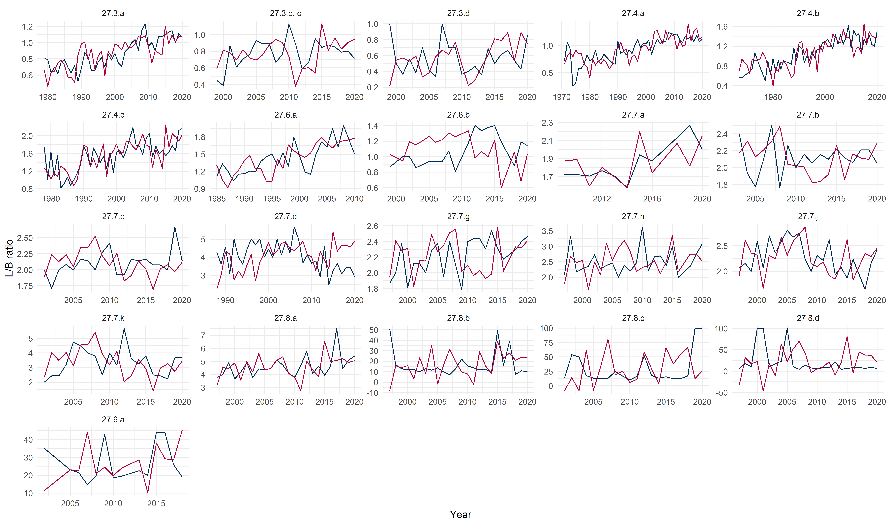

Fish distribution indicator
================

## Figure 1

*Temporal development of the Lusitanian/Boreal species ratio with 5 year
interval, 1965-2016*

## Figure 2

*Temporal development in the number of species of each biogeographical
affinity group*

## Figure 3

*Temporal development of the ratio between the number of Lusitanian and
Boreal species*

## Table 1

| Division | Survey.name | Gear | Quarter | Start.year |
| :------- | :---------- | :--- | ------: | ---------: |
| 3.a      | NS-IBTS     | GOV  |       1 |       1979 |
| 3.b, c   | BITS        | TVS  |       1 |       1999 |
| 3.d      | BITS        | TVS  |       1 |       1999 |
| 4.a      | NS-IBTS     | GOV  |       1 |       1971 |
| 4.b      | NS-IBTS     | GOV  |       1 |       1967 |
| 4.c      | NS-IBTS     | GOV  |       1 |       1978 |
| 6.a      | SWC-IBTS    | GOV  |       1 |       1985 |
| 6.b      | ROCKALL     | GOV  |       3 |       1999 |
| 6.b      | SCOROC      | GOV  |       3 |       2011 |
| 7.a      | NIGFS       | ROT  |       4 |       2009 |
| 7.b      | IE-IGFS     | GOV  |       4 |       2003 |
| 7.c      | SP-PORC     | PORB |       3 |       2001 |
| 7.d      | FR-CGFS     | GOV  |       4 |       1988 |
| 7.e      | BTS         | BT4S |       3 |       2006 |
| 7.f      | BTS         | BT4A |       3 |       1993 |
| 7.g      | EVHOE       | GOV  |       4 |       1997 |
| 7.h      | EVHOE       | GOV  |       4 |       1997 |
| 7.j      | EVHOE       | GOV  |       4 |       1997 |
| 7.k      | SP-PORC     | PORB |       3 |       2001 |
| 8.a      | EVHOE       | GOV  |       4 |       1997 |
| 8.b      | EVHOE       | GOV  |       4 |       1997 |
| 8.c      | SP-NORTH    | BAK  |       4 |       2001 |
| 8.d      | EVHOE       | GOV  |       4 |       1997 |
| 9.a      | PT-IBTS     | NCT  |       4 |       2002 |

## Notes

  - revised values for SP-NORTH in 2017, more species added
  - revised values for SP-PORC in 2011-2013 and 2015, more species added
